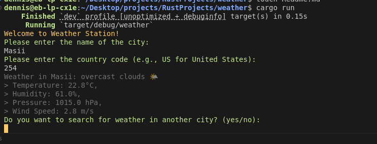

#Weather station


This is a simple weather application that fetches and siplays weather information from the open weather map api based on the users input of the city name and country code.



**Dependancies**


__Serde__ :A Rust library for serializing and deserializing data structures colored - A Rust library for terminal text coloring reqwest - A Rust library for making HTTP requests 


**How to run**


Ensure you have rust installed navigate to the root of the project directory on your terminal and run:

```
cargo run

```